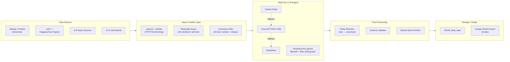

# FrontierAtlas — AI Intelligence Graph Ingestion Pipeline

A scalable, fault-tolerant ingestion pipeline that acquires, enriches, and canonicalizes multi-dimensional data from the AI ecosystem — **startups, products, research papers, jobs, and news** — and structures it into a canonical JSON schema using a multi-tier LLM extraction engine.

---

## Table of Contents

- [Architecture Overview](#architecture-overview)
- [Pipeline Phases](#pipeline-phases)
- [Project Structure](#project-structure)
- [Setup Instructions](#setup-instructions)
- [Running the Pipeline](#running-the-pipeline)
- [Output Schemas](#output-schemas)
- [Key Engineering Strategies](#key-engineering-strategies)
- [Scaling to 500k+ Records](#scaling-to-500k-records)
- [Deliverables](#deliverables)

---

## Architecture Overview



**Data flow:** async crawlers fetch raw HTML → a freshness/dedup gate drops stale or already-seen URLs → raw text is chunked and structured into canonical JSON by the LLM fallback chain → entities are resolved to canonical names and validated against schema → records land in JSONL and are exported to Google Sheets.

Every record carries its **original source URL** — nothing is generated by the LLM without a traceable source (zero-hallucination policy).

---

## Pipeline Phases

| Phase                                          | What it does                                                                                                                                                                                                                                                  |
| ---------------------------------------------- | ------------------------------------------------------------------------------------------------------------------------------------------------------------------------------------------------------------------------------------------------------------- |
| **I. Massive One-Time Data Acquisition** | Highly concurrent scraper for large directories. Targets:**1,000+ startups**, **1,000+ products**, **1,000+ research papers** correlated with GitHub repos and live star counts. Papers come from the arXiv API with repos linked from abstracts + the Hugging Face Papers API (Papers with Code, the suggested source, was sunset in 2025 and now redirects to Hugging Face - the pipeline adapts while keeping every record traceable to a real arXiv URL).                                 |
| **II. High-Fidelity Signal Ingestion**   | Monitors 9 AI news sources and 11 AI job boards (brief minimum: 5 + 5). Guarantees all ingested items were published within the**last 24 hours**, with full-text extraction and date normalization (relative dates like "2 hours ago", missing meta tags, last-run heuristics). |
| **III. Multi-Tier LLM Extraction**       | Structures raw HTML/text into canonical JSON via a fallback chain (**Gemini Flash → Groq (GPT-OSS 120B) → DeepSeek**), with intelligent chunking to avoid 413s and exponential backoff + jitter for 429s.                                                    |
| **IV. Deterministic Entity Resolution**  | Canonicalizes messy names — "OpenAI", "OpenAI, Inc.", "Open AI" all resolve to**OpenAI** — against a seed database of 50 known AI startups, with a full raw→canonical mapping log.                                                                   |
| **V. Anti-Bot & Scale**                  | Fully asynchronous crawling; layered strategy for Cloudflare/Datadome-protected and JS-heavy domains (see[Anti-Bot Strategy](#anti-bot-strategy)).                                                                                                             |
| **VI. Architecture & Production Design** | Detailed design documentation in[architecture.md](architecture.md): scale strategy, 413/429 handling, distributed freshness tracking, and storage justification.                                                                                               |

---

## Project Structure

```
AI_Task/
├── README.md                  # You are here
├── architecture.md            # Detailed design documentation (Phase VI)
├── architecture.pdf           # Same document, rendered for submission
├── requirements.txt           # Python dependencies
├── .env.example               # Template for API keys / config
├── .github/workflows/ci.yml   # CI: compile + unit tests on every push
├── data/                      # Pipeline outputs (JSONL + CSV export)
├── tests/                     # Unit tests (pytest)
└── src/
    ├── main.py                # CLI entrypoint — runs any phase
    ├── config.py              # Env config, source registries, constants
    ├── models.py              # Canonical record schemas + validation
    ├── enrich.py              # Idempotent backfill (stars, summaries)
    ├── verify.py              # Anti-hallucination audit (5 checks)
    ├── crawlers/
    │   ├── startups.py        # Phase I  — startup directory scraper
    │   ├── products.py        # Phase I  — product directory scraper
    │   ├── papers.py          # Phase I  — arXiv + HF Papers + GitHub stars
    │   ├── news.py            # Phase II — 9 news sources, 24-hr fresh
    │   └── jobs.py            # Phase II — 11 job boards, 24-hr fresh
    ├── llm/
    │   ├── orchestrator.py    # Phase III — provider fallback chain
    │   ├── chunking.py        # Phase III — payload truncation (413 guard)
    │   └── ratelimit.py       # Phase III — backoff + jitter (429 guard)
    ├── resolution/
    │   ├── resolver.py        # Phase IV — raw → canonical entity mapping
    │   └── seed_entities.json # 50 known canonical AI startups
    ├── antibot/
    │   └── stealth.py         # Phase V — headers, TLS, Playwright stealth
    ├── storage/
    │   ├── jsonl_sink.py      # Append-only JSONL writer
    │   └── sheets_export.py   # Google Sheets export (6 tabs)
    └── utils/
        ├── dates.py           # Relative-date parsing & ISO-8601 normalization
        ├── dedup.py           # URL fingerprinting / seen-set
        └── log.py             # Structured logging setup
```

---

## Setup Instructions

### Prerequisites

- Python **3.11+**
- Git

### 1. Clone and create a virtual environment

```bash
git clone https://github.com/Manureddy148/AI_Task.git
cd AI_Task

python -m venv .venv
# Windows
.venv\Scripts\activate
# macOS / Linux
source .venv/bin/activate
```

### 2. Install dependencies

```bash
pip install -r requirements.txt
playwright install chromium   # only needed for JS-rendered / protected sources
```

### 3. Configure API keys

```bash
# Windows
copy .env.example .env
# macOS / Linux
cp .env.example .env
```

Then fill in `.env`:

```ini
GEMINI_API_KEY=your_key_here      # Tier 1 — Gemini Flash
GROQ_API_KEY=your_key_here        # Tier 2 — Groq (GPT-OSS 120B)
DEEPSEEK_API_KEY=your_key_here    # Tier 3 — DeepSeek
GITHUB_TOKEN=your_token_here      # GitHub stars enrichment (higher rate limits)
```

> The pipeline degrades gracefully: if a provider key is missing, that tier is skipped and the chain falls through to the next provider.

---

## Running the Pipeline

Each phase is runnable independently through the single CLI entrypoint:

```bash
# Phase I — bulk acquisition (startups, products, research papers)
python -m src.main bulk --vertical startups --min-records 1000
python -m src.main bulk --vertical products --min-records 1000
python -m src.main bulk --vertical papers   --min-records 1000

# Phase II — fresh signals (last 24 hours only)
python -m src.main signals --vertical news
python -m src.main signals --vertical jobs

# Phase IV — entity resolution over collected records
python -m src.main resolve

# Backfill enrichment gaps left by rate limits (idempotent — safe to re-run)
python -m src.main enrich --vertical all

# Export everything to Google Sheets (6 tabs)
python -m src.main export --target sheets

# Anti-hallucination audit: schema, live URL provenance, freshness, dedup, stars
python -m src.main verify
```

Outputs are written as JSONL to `data/<vertical>.jsonl`, one validated record per line; `export` also writes CSVs for all six tabs to `data/export/`.

### Running the tests

```bash
python -m pytest tests/ -q      # 21 unit tests; also run in CI on every push
```

---

## Output Schemas

All records share a common envelope and are validated before storage:

```json
{
  "schemaVersion": "1.0",
  "recordType": "STARTUP | PRODUCT | RESEARCH_PAPER | JOB | NEWS",
  "source": { "name": "<source site>", "url": "<original source URL>" },
  "content": { "...": "record-type-specific fields" },
  "collectedAt": "2026-08-27T12:00:00Z"
}
```

Record-type-specific fields (per the task spec):

| Record type              | Key fields                                                                                                                                    |
| ------------------------ | --------------------------------------------------------------------------------------------------------------------------------------------- |
| **STARTUP**        | `content.entityName` (canonical), `content.data.employeeCount`                                                                            |
| **PRODUCT**        | `content.startupName` (canonical), `content.pricingModel` (`FREE` \| `FREEMIUM` \| `PAID` \| `ENTERPRISE`)                        |
| **RESEARCH_PAPER** | `content.title`, `content.authors[]`, `content.paper_url`, `content.github_url`, `content.github_stars`, `content.published_date` |
| **JOB**            | `content.company` (canonical), `content.date`, `content.is_remote`, `content.role_family`                                             |

All timestamps are **ISO-8601**.

---

## Key Engineering Strategies

### LLM Orchestration — 429s, 413s, and fallback

- **Fallback chain:** every extraction attempts **Gemini Flash** first; on hard failure (exhausted retries, provider outage, unparseable output) it falls through to **Groq (GPT-OSS 120B)**, then **DeepSeek**. The provider that succeeded is recorded on each record for auditability.
- **413 / context overflow — intelligent chunking:** raw HTML is stripped to semantically dense text (boilerplate, nav, scripts removed) and token-estimated *before* sending. Payloads over the provider budget are truncated head+tail-biased (title, metadata, and lead content are preserved) so a 413 is never triggered.
- **429 / rate limits — backoff + jitter:** exponential backoff with full jitter (`sleep = random(0, base * 2^attempt)`, capped), honoring `Retry-After` headers when present. A per-provider token bucket smooths concurrent request bursts.

### Freshness & Deduplication

- Publication dates are extracted from meta tags (`article:published_time`, JSON-LD), sitemaps, RSS, and visible text — including **relative dates** ("2 hours ago", "yesterday") normalized to ISO-8601.
- Sources with no reliable date fall back to a **first-seen heuristic**: content is fingerprinted (normalized URL + content hash) and only items unseen since the last run are treated as new.
- The seen-set guarantees the same article/job is **never processed twice**, and the 24-hour freshness gate is enforced *before* any LLM spend.

### Entity Resolution

Deterministic, layered matching against `seed_entities.json` (50 canonical AI startups):

1. **Normalization** — lowercase, strip legal suffixes (`Inc.`, `Ltd.`, `Corp.`), collapse whitespace/punctuation.
2. **Exact + alias match** — against canonical names and known aliases.
3. **Fuzzy match** — token-set similarity with a conservative threshold; below-threshold names pass through unchanged (no forced matches).

Every decision is written to the **Entity Mapping Log** (raw name → canonical name → match method → confidence).

### Anti-Bot Strategy

Layered escalation — cheapest method first:

1. **Plain async HTTP** (aiohttp) with realistic browser headers, referers, and per-domain politeness delays.
2. **TLS-fingerprint-aware clients** for sources that block default Python TLS signatures.
3. **Playwright (async)** with stealth patches for JS-rendered pages and Cloudflare/Datadome-protected domains.
4. **Proxy rotation + per-domain concurrency caps** to stay under detection thresholds and avoid captcha triggers.

Full details and trade-offs are documented in [architecture.md](architecture.md).

---

## Scaling to 500k+ Records

The architecture scales through **infrastructure, not code changes**:

- **Stateless workers:** crawlers pull URLs from a work queue; scaling = adding worker processes/machines. No coordination logic lives in the scraper itself.
- **Idempotent, checkpointed ingestion:** the seen-set and append-only JSONL sinks make retries and resumes safe at any point.
- **Distributed dedup:** the URL fingerprint set moves from an in-process set to a shared store (e.g., Redis) with no interface change.
- **LLM throughput:** provider tiers are horizontal capacity — the same fallback chain spreads load across providers under sustained volume.

The full 500k scale strategy, storage justification (primary DB + vector/graph store), and distributed freshness design are covered in [architecture.md](architecture.md).

---

## Deliverables

- [ ] **Data Output (Google Sheets)** — public sheet with 6 tabs: Startups (1,000+), Products (1,000+), Research Papers (1,000+ with GitHub stars), Jobs (24-hr fresh), News (24-hr fresh), Entity Mapping Log. *(Link added on completion; `python -m src.main export` produces all 6 tabs.)*
- [X] **README.md** — setup instructions and architecture overview (this file).
- [X] **src/** — crawler, LLM orchestrator, and entity resolver source code.
- [X] **architecture.pdf** — detailed design documentation ([architecture.pdf](architecture.pdf), generated from [architecture.md](architecture.md)).

> **Data integrity:** every record in every output traces back to a legitimate, valid source URL. No LLM-generated (hallucinated) data enters the pipeline.

---

## Task Reference

The complete assessment brief is in [AI Engineer_August 2026.pdf](<AI%20Engineer_August%202026.pdf>).
